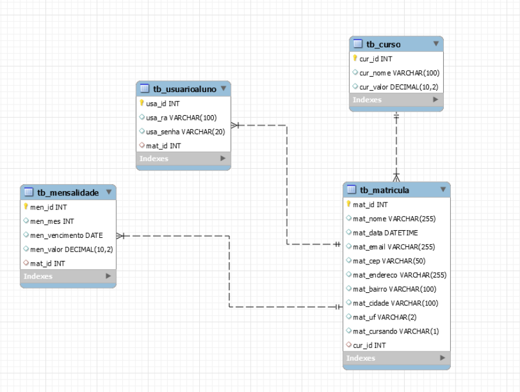

# UNILESTE API - Sistema de Matrícula Universitária

API RESTful desenvolvida para o processo de matrícula de alunos da UNILESTE (Universidade do Leste Paulista), permitindo o gerenciamento de cursos, matrículas e mensalidades dos estudantes.

## 📋 Sobre o Projeto

Esta API foi desenvolvida para ser consumida pelo frontend existente da universidade, adicionando funcionalidades digitais ao site institucional. O sistema permite que alunos consultem cursos disponíveis, realizem matrículas e consultem suas mensalidades após autenticação.

## 🚀 Funcionalidades

A API oferece os seguintes endpoints:

### Endpoints Públicos

- **Cursos**: Retorna todos os cursos cadastrados no banco de dados
- **Matrícula**: Permite realizar a matrícula de um novo aluno
  - Gera automaticamente as mensalidades do semestre (a partir de 07/2024)
  - Gera um RA e senha para acesso do aluno
- **Autenticação**: Gera token JWT para acesso aos endpoints restritos

### Endpoints Restritos

- **Mensalidades**: Retorna as mensalidades do aluno autenticado (status cursando = 'S')

## 🛠️ Tecnologias Utilizadas

- Node.js
- Express
- JWT para autenticação
- Sistema de transações para garantir consistência no banco de dados

## 📊 Modelo Relacional

O sistema utiliza o seguinte modelo de banco de dados:

## 📝 Especificações Técnicas

### Matrícula

A matrícula de novos alunos requer as seguintes informações:
- Nome
- E-mail
- CEP
- Endereço
- Bairro
- Cidade
- Estado
- Curso (objeto)

### Autenticação

A autenticação é realizada via RA e senha gerados durante o processo de matrícula.

### Processamento de Mensalidades

O sistema gera automaticamente as mensalidades do semestre durante o processo de matrícula, com início em 07/2024.

## ⚙️ Implementação

A implementação utiliza o conceito de transações para garantir a consistência dos dados durante o processo de matrícula. Isso previne inconsistências no banco de dados caso alguma etapa falhe durante o registro.

## 📚 Documentação

Todos os endpoints estão documentados com:
- Tag
- Sumário
- Corpo da requisição (quando aplicável)
- Requisitos de autenticação (quando aplicável)

## 🏁 Como Iniciar

1. Clone este repositório
2. Instale as dependências com `npm install`
3. Configure o banco de dados utilizando o script fornecido
4. Inicie o servidor com `npm start`

## 🔒 Segurança

Os endpoints restritos requerem autenticação via token JWT, que deve ser obtido através do endpoint de autenticação.
